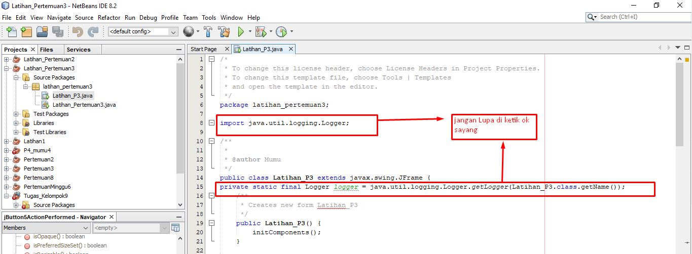
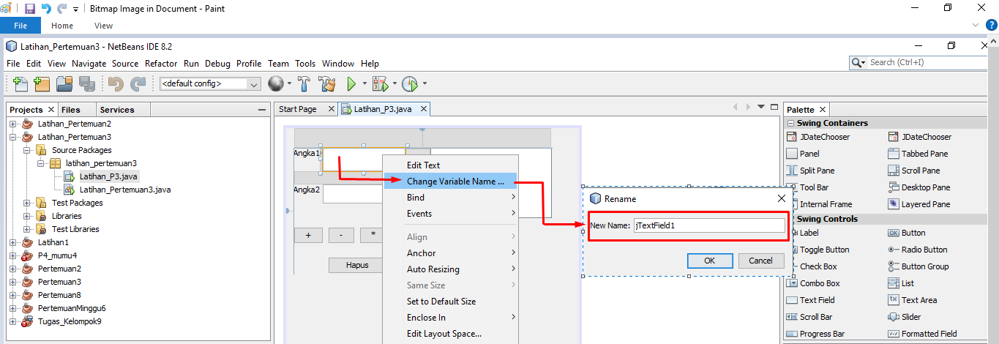
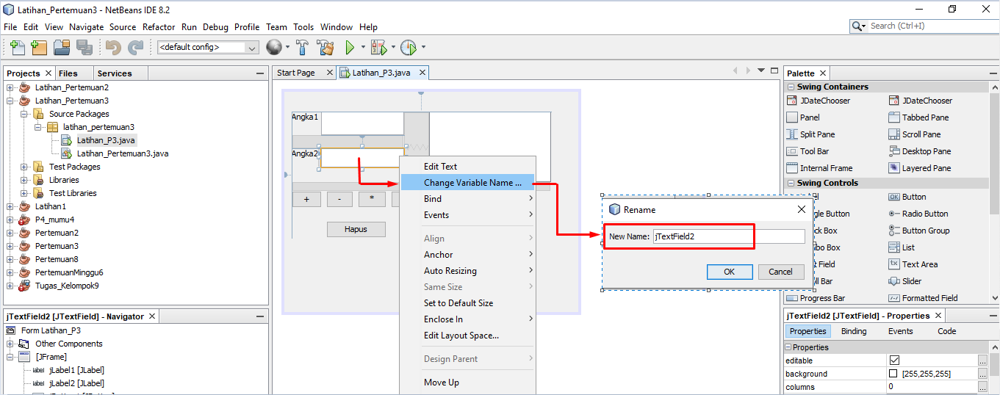
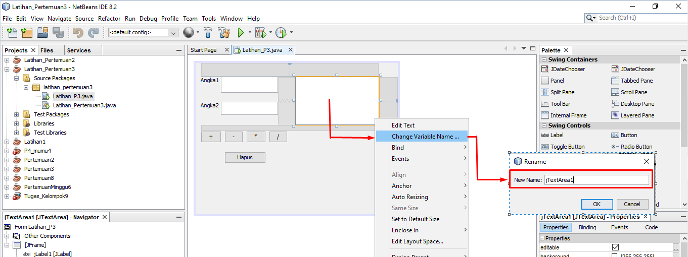
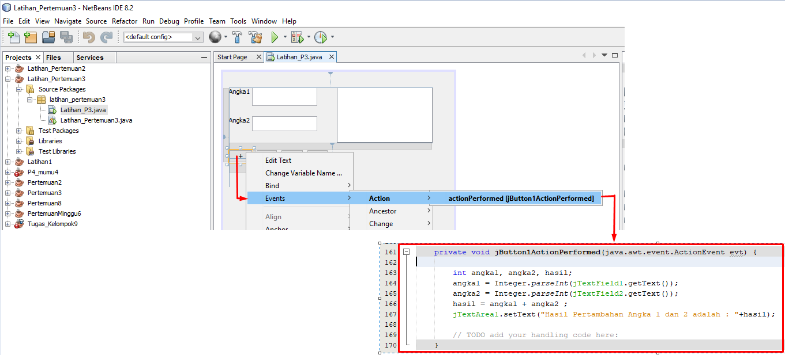
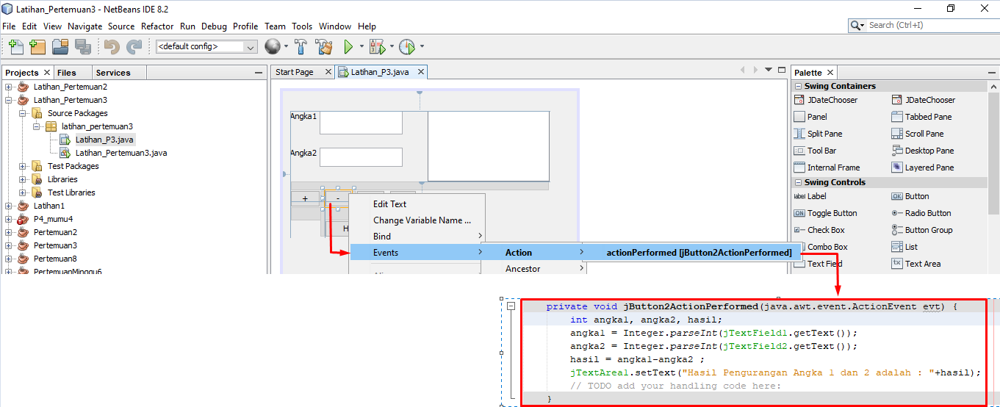
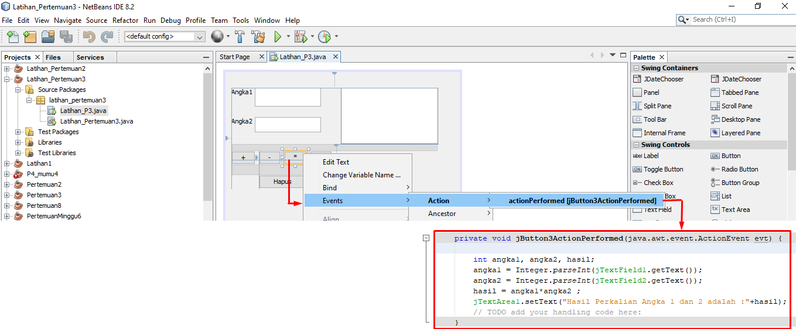
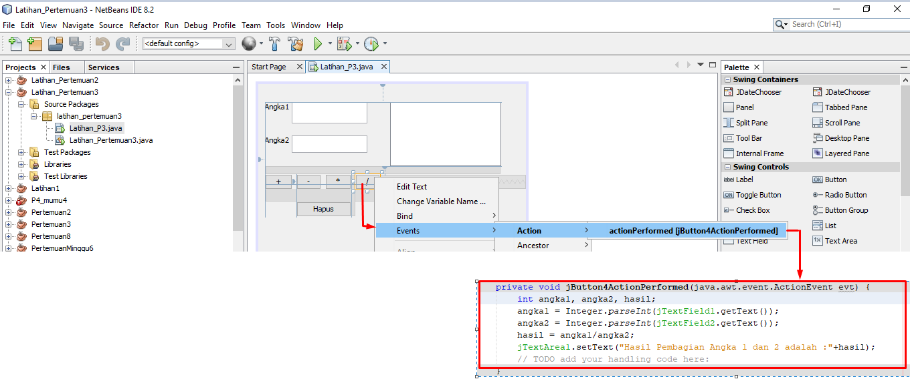
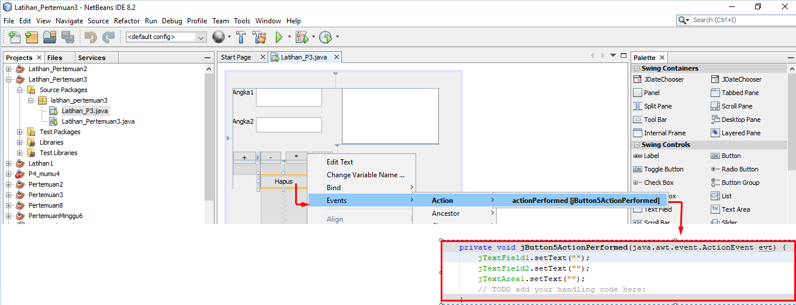

## JAVA

## 1. Membuat Aplikasi Penghitungan Lewat Java

## 2. jangan Lupa di Ketik Sayang

## 3. Jangan Lupa Klik Change Variable Name Tulis (jTextField1) 

## 4. Jangan Lupa Klik Change Variable Name Tulis (jTextField2) 

## 5. Jangan Lupa Klik Change Variable Name Tulis (jTextArea1) 

## 6. Jangan Lupa Klik ==>> Events ==>> Action ==>> actionPerformed[jButton1ActionPerformed] Tulis Code Pertambahan

## 7. Jangan Lupa Klik ==>> Events ==>> Action ==>> actionPerformed[jButton1ActionPerformed] Tulis Code Pengurangan 

## 8. Jangan Lupa Klik ==>> Events ==>> Action ==>> actionPerformed[jButton1ActionPerformed] Tulis Code Perkalian 

## 9. Jangan Lupa Klik ==>> Events ==>> Action ==>> actionPerformed[jButton1ActionPerformed] Tulis Code Pembagian 

## 9. Jangan Lupa Klik ==>> Events ==>> Action ==>> actionPerformed[jButton1ActionPerformed] Tulis Code Hapus

